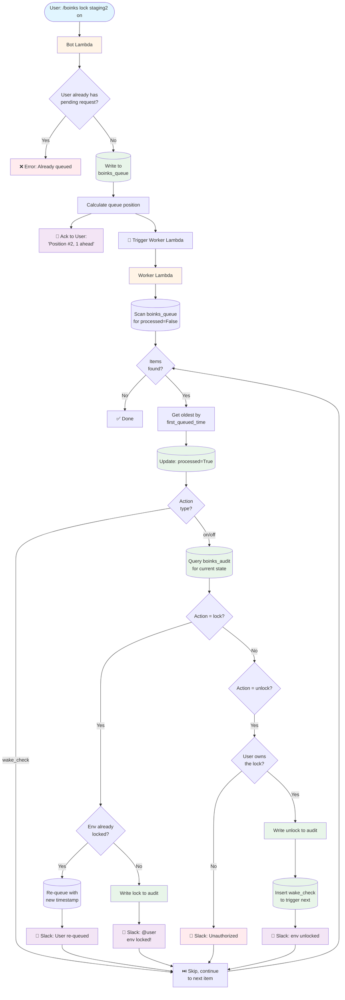
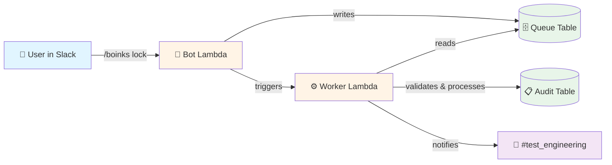
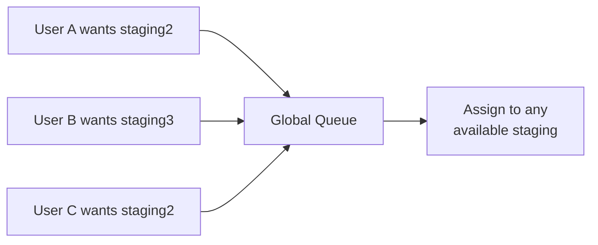
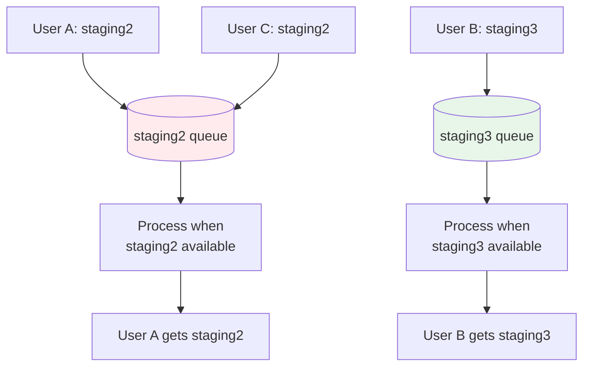
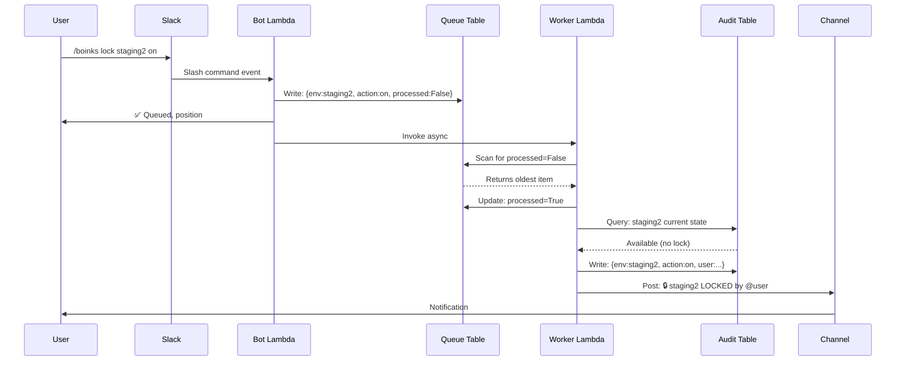

# BoinksBot Architecture - User Flow

## Mermaid Diagram

---

## Simplified View

---

## Key Differences From "Global Queue" Misconception

### ❌ What Your Colleague Thought:

### ✅ What You Actually Built:

---

## Data Flow

---

## Copy-Paste This To Your Colleague! 😄

This shows:
- ✅ Per-environment queuing (not global)
- ✅ Validation & conditional processing
- ✅ Re-queuing on contention
- ✅ Ownership checks
- ✅ Wake-check mechanism

