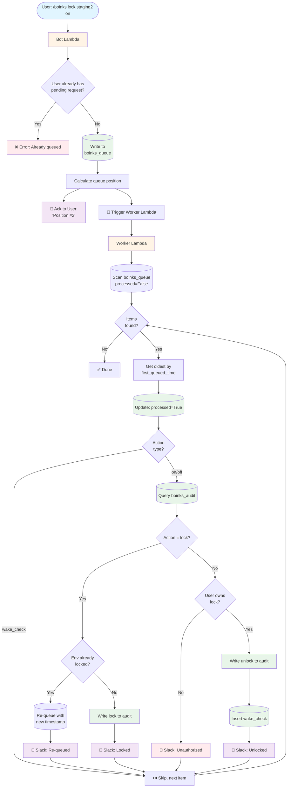
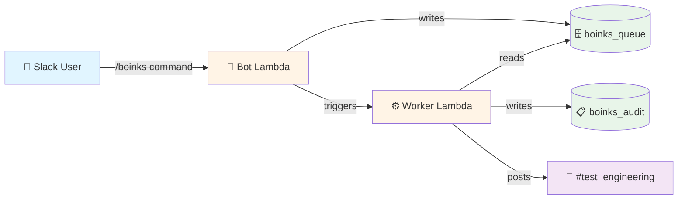
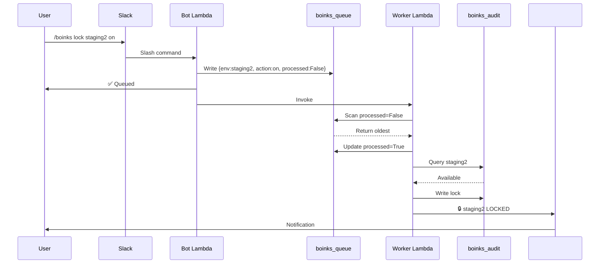

# BoinksBot Architecture Diagram

```mermaid
flowchart TD
    Start([User: /boinks lock staging2 on]) --> BotLambda[Bot Lambda]
    
    BotLambda --> CheckDupe{User already has<br/>pending request?}
    CheckDupe -->|Yes| RejectDupe[❌ Error: Already queued]
    CheckDupe -->|No| WriteQueue[(Write to<br/>boinks_queue)]
    
    WriteQueue --> QueuePos[Calculate queue position]
    QueuePos --> AckUser[📱 Ack to User:<br/>'Position #2']
    QueuePos --> TriggerWorker[🔔 Trigger Worker Lambda]
    
    TriggerWorker --> WorkerStart[Worker Lambda]
    
    WorkerStart --> ScanQueue[(Scan boinks_queue<br/>processed=False)]
    ScanQueue --> HasItems{Items<br/>found?}
    
    HasItems -->|No| Done1[✅ Done]
    HasItems -->|Yes| GetOldest[Get oldest by<br/>first_queued_time]
    
    GetOldest --> MarkProcessed[(Update: processed=True)]
    MarkProcessed --> CheckAction{Action<br/>type?}
    
    CheckAction -->|wake_check| Skip[⏭️ Skip, next item]
    CheckAction -->|on/off| QueryAudit[(Query boinks_audit)]
    
    QueryAudit --> IsLock{Action = lock?}
    
    IsLock -->|Yes| CheckContention{Env already<br/>locked?}
    CheckContention -->|Yes| Requeue[(Re-queue with<br/>new timestamp)]
    Requeue --> NotifyContention[📢 Slack: Re-queued]
    NotifyContention --> Skip
    
    CheckContention -->|No| ProcessLock[Write lock to audit]
    ProcessLock --> NotifyLock[📢 Slack: Locked]
    NotifyLock --> Skip
    
    IsLock -->|No| ValidateOwner{User owns<br/>lock?}
    ValidateOwner -->|No| RejectUnlock[📢 Slack: Unauthorized]
    RejectUnlock --> Skip
    
    ValidateOwner -->|Yes| ProcessUnlock[Write unlock to audit]
    ProcessUnlock --> InsertWake[(Insert wake_check)]
    InsertWake --> NotifyUnlock[📢 Slack: Unlocked]
    NotifyUnlock --> Skip
    
    Skip --> HasItems
    
    style Start fill:#e1f5ff
    style BotLambda fill:#fff4e6
    style WorkerStart fill:#fff4e6
    style WriteQueue fill:#e8f5e9
    style QueryAudit fill:#e8f5e9
    style MarkProcessed fill:#e8f5e9
    style ProcessLock fill:#e8f5e9
    style ProcessUnlock fill:#e8f5e9
    style InsertWake fill:#e8f5e9
    style NotifyLock fill:#f3e5f5
    style NotifyUnlock fill:#f3e5f5
    style NotifyContention fill:#f3e5f5
    style AckUser fill:#f3e5f5
    style RejectDupe fill:#ffebee
    style RejectUnlock fill:#ffebee
```

---

## Component View

```mermaid
flowchart LR
    User[👤 Slack User] -->|/boinks command| Bot[🤖 Bot Lambda]
    Bot -->|writes| Queue[(🗄️ boinks_queue)]
    Bot -->|triggers| Worker[⚙️ Worker Lambda]
    Worker -->|reads| Queue
    Worker -->|writes| Audit[(📋 boinks_audit)]
    Worker -->|posts| Slack[💬 #test_engineering]
    
    style User fill:#e1f5ff
    style Bot fill:#fff4e6
    style Worker fill:#fff4e6
    style Queue fill:#e8f5e9
    style Audit fill:#e8f5e9
    style Slack fill:#f3e5f5
```

---

## Sequence Diagram

```mermaid
sequenceDiagram
    participant U as User
    participant S as Slack
    participant B as Bot Lambda
    participant Q as boinks_queue
    participant W as Worker Lambda
    participant A as boinks_audit
    participant C as #test_engineering
    
    U->>S: /boinks lock staging2 on
    S->>B: Slash command
    B->>Q: Write {env:staging2, action:on, processed:False}
    B->>U: ✅ Queued #1
    B->>W: Invoke
    
    W->>Q: Scan processed=False
    Q-->>W: Return oldest
    W->>Q: Update processed=True
    
    W->>A: Query staging2
    A-->>W: Available
    
    W->>A: Write lock
    W->>C: 🔒 staging2 LOCKED
    C->>U: Notification
```

